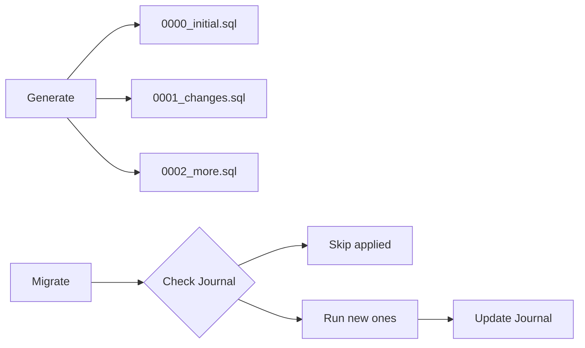

# Drizzle ORM Guide

## Configuration Overview

Your Drizzle setup consists of these files:

| File | Purpose |
|------|---------|
| `drizzle.config.ts` | Drizzle Kit CLI configuration |
| `src/db/index.ts` | Database connection for your app |
| `src/db/schema.ts` | Table definitions |
| `.env` | Environment variables including `DATABASE_URL` |

---

## Creating Tables in PostgreSQL

### Option A: Push Schema Directly (Quick, for Development)

Immediately syncs your schema to the database without migration files:

```bash
npx drizzle-kit push
```

**Pros:** Fast, no migration files to manage  
**Cons:** No migration history, not suitable for production

---

### Option B: Generate & Run Migrations (Recommended)

Creates SQL migration files that can be version-controlled.

**Step 1: Generate migration files**
```bash
npx drizzle-kit generate
```

**Step 2: Apply migrations**
```bash
npx drizzle-kit migrate
```

---

## How Multiple Migrations Work

When you run `npx drizzle-kit generate` multiple times after schema changes, Drizzle creates **incremental migration files**:

```
drizzle/
├── 0000_initial_migration.sql      # First generate
├── 0001_add_new_column.sql         # Second generate (after schema change)
├── 0002_create_orders_table.sql    # Third generate (after another change)
└── meta/
    └── _journal.json               # Tracks which migrations have been applied
```

### What happens when you run `migrate`?

1. Drizzle reads `meta/_journal.json` to see which migrations are already applied
2. It runs **only the new migrations** that haven't been applied yet
3. After each migration runs, it's recorded in the journal



### Example Workflow

```bash
# Day 1: Initial schema
npx drizzle-kit generate    # Creates 0000_initial.sql
npx drizzle-kit migrate     # Applies 0000

# Day 2: Add a new column to person table
# Edit schema.ts...
npx drizzle-kit generate    # Creates 0001_add_column.sql
npx drizzle-kit migrate     # Applies only 0001 (skips 0000)

# Day 3: Add a new table
# Edit schema.ts...
npx drizzle-kit generate    # Creates 0002_new_table.sql
npx drizzle-kit migrate     # Applies only 0002
```

---

## Drizzle Studio

Drizzle Studio is a **visual database browser** that runs locally in your browser.

### Start Studio
```bash
npx drizzle-kit studio
```

Opens at: `https://local.drizzle.studio`

### Features

| Feature | Description |
|---------|-------------|
| Browse Tables | View all tables and their structure |
| View Data | See rows in a spreadsheet-like interface |
| Edit Data | Add, modify, or delete rows directly |
| Run Queries | Execute custom SQL queries |
| Filter & Sort | Filter data by column values |

### How It Works

1. Drizzle Kit reads your `drizzle.config.ts` to get the database connection
2. It starts a local proxy server
3. Opens a web UI that connects through the proxy
4. All operations go directly to your database

> **Note:** This connects to your actual database. Changes you make in Studio are real!

---

## Verification Commands

Check tables exist:
```bash
docker exec -it recruitment-db psql -U postgres -d recruit_db -c "\dt"
```

Check table structure:
```bash
docker exec -it recruitment-db psql -U postgres -d recruit_db -c "\d person"
```

---

## Quick Reference

| Command | Purpose |
|---------|---------|
| `npx drizzle-kit generate` | Create migration files from schema changes |
| `npx drizzle-kit migrate` | Apply pending migrations |
| `npx drizzle-kit push` | Push schema directly (no migration files) |
| `npx drizzle-kit studio` | Open visual database browser |
| `npx drizzle-kit check` | Validate config without connecting |

---

## How Migrations Affect Existing Data

### Adding a Column

| Scenario | What Happens to Existing Data |
|----------|------------------------------|
| Add column **without** default | Existing rows get `NULL` |
| Add column **with** default | Existing rows get the default value |
| Add column with `NOT NULL` (no default) | ❌ **Migration fails** |

**Example:**
```typescript
// Adding a phone column
phone: varchar({ length: 20 }),                      // ✅ Existing rows get NULL
phone: varchar({ length: 20 }).default("N/A"),       // ✅ Existing rows get "N/A"
phone: varchar({ length: 20 }).notNull(),            // ❌ FAILS
phone: varchar({ length: 20 }).notNull().default("unknown"),  // ✅ Works
```

### Removing a Column

| Scenario | What Happens |
|----------|--------------|
| Drop a column | **Data is permanently deleted** |

> ⚠️ **Warning:** This is destructive! All data in that column is lost forever.

### Renaming a Column

Drizzle may interpret a rename as "drop old + add new", which **loses data**. To preserve data, manually edit the migration:

```sql
ALTER TABLE "person" RENAME COLUMN "old_name" TO "new_name";
```

### Changing Column Type

| Change | Effect |
|--------|--------|
| `varchar(50)` → `varchar(100)` | ✅ Safe — data preserved |
| `varchar(100)` → `varchar(50)` | ⚠️ Data may be truncated |
| `varchar` → `integer` | ⚠️ Fails if data can't convert |

### Summary

| Operation | Data Safe? | Notes |
|-----------|------------|-------|
| Add nullable column | ✅ Yes | Existing rows get NULL |
| Add column with default | ✅ Yes | Existing rows get default |
| Add NOT NULL column | ❌ Fails | Must provide default |
| Drop column | ❌ **Data lost** | Cannot be recovered |
| Rename column | ⚠️ Careful | May lose data if not done correctly |
| Widen type (50→100) | ✅ Yes | Safe |
| Narrow type (100→50) | ⚠️ Risk | May truncate |

**Best practice:** Always review generated migration SQL before running `migrate`!

