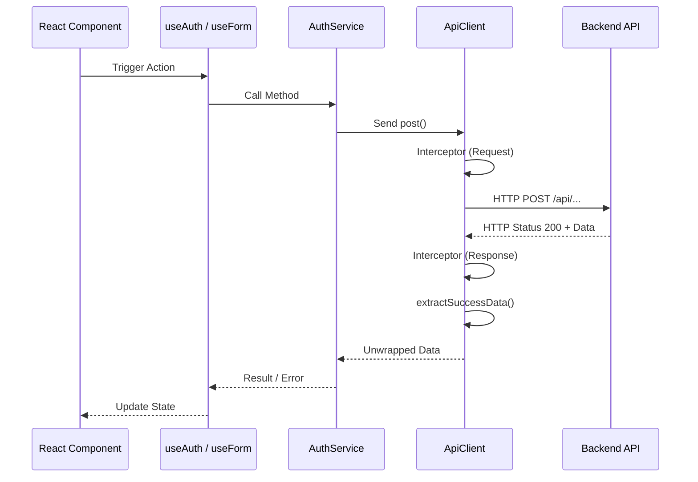

# Frontend Services & API Layer: Technical Deep Dive

This document provides a highly detailed, function-by-function breakdown of the communication layer that connects the React frontend to the backend API.

---

## 1. The Core: API Client (`api.ts`)

The [api.ts](frontend/src/services/api.ts) file houses the `ApiClient` class, a singleton wrapper around **Axios**.

### 1.0 What is Axios?
[Axios](https://axios-http.com/) is a promise-based HTTP client for the browser and Node.js. In this project, it acts as the "bridge" between the React frontend and the backend server. We use Axios instead of the native `fetch` API because it offers several advantages:
- **Interceptors**: Allows us to run code for every request or response (e.g., global error handling).
- **Auto-Transformation**: It automatically converts JSON data into JavaScript objects.
- **CSRF Protection**: It has built-in support for security features.
- **Request Cancellation**: Easier management of pending requests.
- **Cookie Support**: Seamless handling of credentials and sessions via `withCredentials`.

---

### 1.1 API Communication Flow
The following diagram illustrates how a request (e.g., Login) flows through our service layers:



---

### 1.2 Initialization & Base Configuration
The constructor sets up the Axios instance with critical security and performance defaults.

```typescript
// frontend/src/services/api.ts
constructor() {
    this.axiosInstance = axios.create({
        baseURL: DEFAULT_API_CONFIG.baseURL, // Matches backend /api prefix
        timeout: DEFAULT_API_CONFIG.timeout, // 10s before failing
        withCredentials: true, // MANDATORY: For cookie-based sessions
        headers: {
            'Content-Type': 'application/json'
        }
    });

    this.setupInterceptors();
}
```

**Why `withCredentials: true`?**
This project uses **Express sessions** with HTTP-only cookies. Without this flag, the browser would block the `Connect.sid` cookie from being sent to or received from the backend, effectively breaking authentication.

---

### 1.2 Global Request Methods
The `ApiClient` provides clean wrappers for standard HTTP verbs. Each method follows a strict pipeline:
1. **Request Execution**: Executes the Axios call.
2. **Success Extraction**: If HTTP 2xx, it strips the Axios wrapper and returns `response.data.success`.
3. **Error Handling**: If HTTP non-2xx, it passes the error to `handleApiError`.

#### `get<T>(url, params)`
Used for fetching data. Serializes the `params` object into a query string.
```typescript
async get<T>(url: string, params?: any): Promise<T> {
    const response = await this.axiosInstance.get<ApiResponse<T>>(url, { params });
    return this.extractSuccessData(response);
}
```

#### `post<T>(url, data)`
Used for creating resources or performing actions (like Login).
```typescript
async post<T>(url: string, data?: any): Promise<T> {
    const response = await this.axiosInstance.post<ApiResponse<T>>(url, data);
    return this.extractSuccessData(response);
}
```

---

## 2. Advanced Error Handling: `apiUtils.ts`

The [apiUtils.ts](frontend/src/services/apiUtils.ts) file provides the logic for handling the "dark side" of network communication.

### 2.1 The `ApiError` Class
Instead of using generic strings, we use a custom `ApiError` class to carry metadata about failures.

```typescript
export class ApiError extends Error {
    public status?: number;
    public code?: string;

    constructor(message: string, status?: number, code?: string) {
        super(message);
        this.status = status;
        this.code = code;
    }
}
```

### 2.2 Centralized Error Parsing
The `parseApiError` function translates complex Axios errors into our structured `ApiError`. It handles:
- **Validation Errors**: Flattens error arrays from `express-validator`.
- **Network Errors**: Detects timeouts or ISP issues.
- **Server Crashes**: Handles 500 status codes gracefully.

---

## 3. High-Level Logic: `authService.ts`

The [authService.ts](frontend/src/services/authService.ts) maps application logic to specific API endpoints.

### 2.1 Login Pipeline (`/auth/login`)
Handles user authentication and session establishment.

- **Request Body**: `{ username: string, password: string }`
- **Success Response**: Returns a `User` object containing `role`, `firstName`, etc.
- **Pipeline Activity**:
    1. Validates that both fields are non-empty.
    2. Sends POST request.
    3. Backend validates credentials and sets an HTTP-only session cookie.
    4. Client receives the cookie (handled by browser) and the user profile.

```typescript
async login(username: string, password: string): Promise<LoginResponse> {
    const response = await apiClient.post<LoginResponse>(API_ENDPOINTS.LOGIN, { username, password });
    return response;
}
```

### 2.2 Registration Pipeline (`/auth/register`)
Handles new user creation.

- **Request Body**: Complete `RegisterData` (firstName, lastName, email, personNumber, username, password).
- **Execution Flow**:
    1. Runs a client-side regex check on the username.
    2. Sends the POST request to the server.
    3. Server hashes the password and persists the user to the database.

---

### 2.3 Real-time Availability Check (`/auth/availability`)
Used for inline validation during registration to check if a username or email is taken.

- **Request Query**: `?username=...` or `?email=...`
- **Response**: `{ usernameTaken: boolean, emailTaken: boolean }`

```typescript
async checkAvailability(params: AvailabilityCheckRequest): Promise<AvailabilityStatus> {
    return await apiClient.get<AvailabilityStatus>(API_ENDPOINTS.CHECK_AVAILABILITY, params);
}
```

---

## 3. Global Interceptors & Security

Interceptors provide a "middleman" for every request and response.

### 3.1 The 401 Unauthorized Interceptor
This is our primary mechanism for handling session expiration.

```typescript
// frontend/src/services/api.ts
this.axiosInstance.interceptors.response.use(
    (response) => response,
    (error) => {
        if (error.response?.status === 401) {
            // 1. Clear local cache
            localStorage.removeItem('user');
            // 2. Broadcast logout event
            window.dispatchEvent(new Event('auth:logout'));
            console.warn('Authentication expired - redirecting to login');
        }
        return Promise.reject(error);
    }
);
```

**Workflow:**
1. If any request fails with a `401`, the interceptor executes.
2. It forcefully clears `localStorage` to ensure the UI doesn't think it's still logged in.
3. It fires a global event. The `AuthContext` listens for this event to nullify its state, which triggers a React re-render and forces the `ProtectedRoute` to redirect the user to `/login`.

---

## 4. Resilience & Optimization Utilities

Built in [apiUtils.ts](frontend/src/services/apiUtils.ts), these helpers make the service layer more robust.

### 4.1 Exponential Backoff Retry (`executeWithRetry`)
If a network error occurs (e.g., brief Wi-Fi cutout), this utility re-attempts the call.

- **Logic**: It waits 1s, then 2s, then 4s... (exponential delay) before giving up.
- **Condition**: By default, it only retries on network errors, not on application errors like 400 or 401.

### 5.2 API Debouncing
In [apiUtils.ts](frontend/src/services/apiUtils.ts), the `debounce` function is used for the availability checks.

```typescript
// Logic summary:
// User types 'a' -> timer starts
// User types 'n' -> timer resets
// User stops for 500ms -> API call is sent
```
This prevents the backend from being flooded with a request for every single keystroke.

---

## 6. Architecture: Barrel Exports

We use a "Barrel" pattern in [index.ts](frontend/src/services/index.ts) to keep our components clean.

```typescript
// frontend/src/services/index.ts
export * from './api';
export * from './authService';
export * from './apiUtils';
```

**Benefit**: Components can import everything they need from `@/services` instead of deep-linking into individual files.
